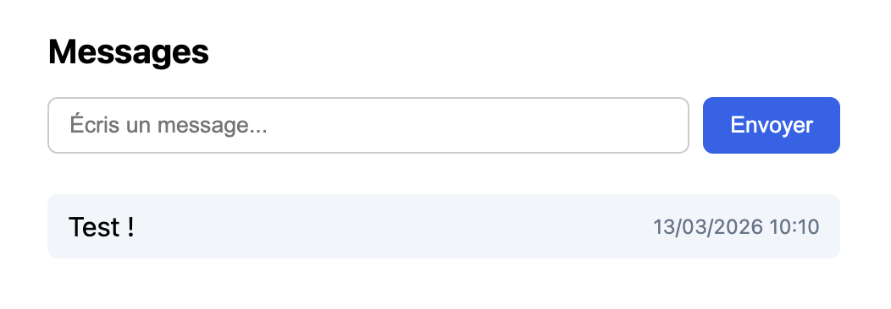
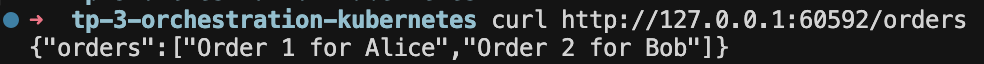
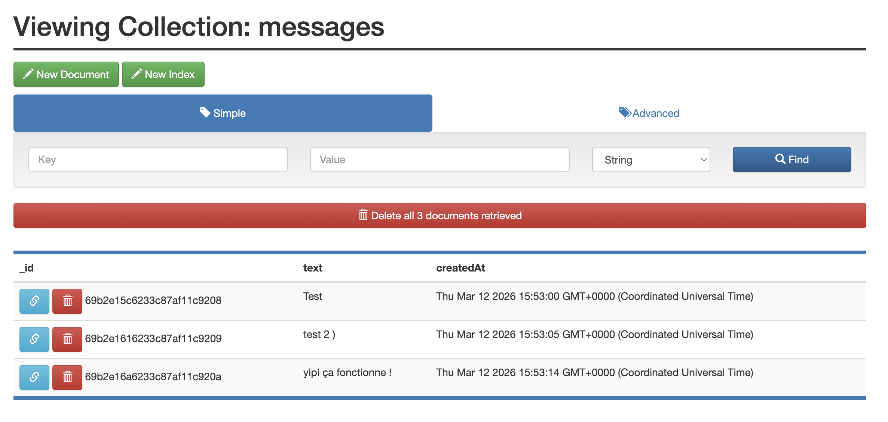

# TP Kubernetes — Application multi-services

Projet multi-conteneurs sur **Kubernetes** : frontend, backend API, MongoDB et interface d’administration (Mongo Express). Le backend se connecte à MongoDB pour stocker et exposer les messages via l’API ; le frontend affiche l’historique et permet d’en envoyer de nouveaux. Déploiement géré avec **Kustomize**. Réutilisation du projet du TP 2 annexe, et adaptation pour Kubernetes

---

## Sommaire

1. [Structure du projet](#1-structure-du-projet)
2. [Composants déployés](#2-composants-déployés)
3. [Démarrer le projet](#3-démarrer-le-projet)
4. [Accéder à l’application (Minikube)](#4-accéder-à-lapplication-minikube)
5. [Tester l’application](#5-tester-lapplication)
6. [Commandes utiles (Makefile)](#6-commandes-utiles-makefile)
7. [Résultat obtenu](#résultat-obtenu)
8. [Informations](#informations)

---

## 1. Structure du projet

```
tp-3-orchestration-kubernetes-annexe/
│
├── backend/
│   ├── server.js          # API Express + MongoDB
│   ├── package.json
│   └── Dockerfile
│
├── frontend/
│   ├── index.html         # Page Messages + formulaire
│   ├── nginx.conf         # Nginx + proxy /api/ → backend
│   └── Dockerfile
│
├── k8s/
│   ├── kustomization.yml  # Liste des ressources
│   ├── namespace.yml      # Namespace tp-k8s
│   ├── mongodb-pvc.yml
│   ├── mongodb-deployment.yml
│   ├── mongodb-service.yml
│   ├── mongo-express-deployment.yml
│   ├── mongo-express-service.yml
│   ├── backend-deployment.yml
│   ├── backend-service.yml
│   ├── frontend-deployment.yml
│   └── frontend-service.yml
│
├── Makefile               # Commandes build, deploy, logs, etc.
└── README.md
```

---

## 2. Composants déployés

### 2.1 Backend (API)

- **Image** : `tp-k8s-backend:latest` (build depuis `./backend`).
- **Connexion MongoDB** : variable d’environnement `MONGODB_URI=mongodb://mongodb:27017/app`.
- **API** :
  - `GET /api/message` → renvoie les 10 derniers messages (ordre anti-chronologique).
  - `POST /api/message` avec body `{ "text": "..." }` → enregistre un message en base.
- Au démarrage, le backend réessaie de se connecter à MongoDB jusqu’à ce que la base soit prête.

### 2.2 Frontend

- **Image** : `tp-k8s-frontend:latest` (build depuis `./frontend`).
- Nginx sert `index.html` et fait un **proxy** de `/api/` vers le service backend. Le frontend appelle donc `/api/message` (URL relative), ce qui fonctionne quel que soit le port d’accès.

### 2.3 MongoDB

- Image **mongo:7**, port 27017.
- Données persistées via un **PersistentVolumeClaim** (`mongodb-pvc.yml`).
- Base utilisée : `app`, collection : `messages` (champs `text`, `createdAt`).

### 2.4 Mongo Express

- Interface web d’administration MongoDB.
- **Identifiants** : **admin** / **admin**.

---

## 3. Démarrer le projet

Prérequis : **Minikube** installé et fonctionnel (avec Docker Desktop comme driver), ainsi que `make`.

### 3.1 Lancer Minikube

À la racine du projet :

```bash
make start
```

Attendre que Minikube affiche un message du type `Done! kubectl is now configured`.

### 3.2 Construire les images (via Minikube)

Toujours à la racine :

```bash
make build
```

Cette commande utilise automatiquement le **Docker de Minikube** (`minikube docker-env`) pour builder les images `tp-k8s-backend:latest` et `tp-k8s-frontend:latest`, visibles depuis le cluster.

### 3.3 Déployer sur le cluster (via Minikube)

```bash
make deploy
```

ou, pour faire build + deploy en une seule commande :

```bash
make up
```

Cela crée le namespace `tp-k8s`, le PVC, les Deployments et Services (mongodb, mongo-express, backend, frontend) en utilisant `minikube kubectl -- apply -k k8s/`

### 3.4 Vérifier que les pods tournent

```bash
make status
```

Cette commande affiche les pods et services du namespace `tp-k8s` via `minikube kubectl -- get ...`. Attendre que tous les pods soient en **Running** (et 1/1 si affiché).

---

## 4. Accéder à l’application (Minikube)

Pour accéder au frontend et à Mongo Express **depuis ta machine**, on utilise directement `minikube service`, qui ouvre le navigateur sur l’URL locale correspondante.

### 4.1 Frontend (page Messages)

```bash
make expose-frontend
```

Cette commande lance `minikube service frontend-service -n tp-k8s` et ouvre automatiquement le navigateur sur une URL de type `http://127.0.0.1:XXXXX`.

### 4.2 Mongo Express (admin MongoDB)

```bash
make expose-mongo-express
```

Cette commande lance `minikube service mongo-express -n tp-k8s` et ouvre le navigateur sur l’interface Mongo Express (login **admin** / **admin**).

---

## 5. Tester l’application

Une fois les services ouverts via Minikube :

| URL | Description |
|-----|-------------|
| **URL ouverte par `make expose-frontend` (type http://127.0.0.1:PORT)** | Frontend : liste des messages + formulaire pour en envoyer |
| **URL_FRONTEND/api/message** | API : GET pour l’historique, POST pour ajouter un message |
| **URL ouverte par `make expose-mongo-express`** | Mongo Express : admin MongoDB (login **admin** / **admin**) |

Exemple d’envoi d’un message via `curl` (en passant par le frontend, donc la même URL que `make expose-frontend`, en remplaçant `URL_FRONTEND`) :

```bash
curl -X POST URL_FRONTEND/api/message \
  -H "Content-Type: application/json" \
  -d '{"text": "Mon message"}'
```

---

## 6. Commandes utiles (Makefile)

À la racine du projet, un **Makefile** regroupe toutes les commandes courantes, basées sur **Minikube**.

| Commande | Description |
|----------|-------------|
| `make start` | Démarrer Minikube |
| `make build` | Construire les images backend et frontend dans le Docker de Minikube |
| `make deploy` | Déployer les manifests (`minikube kubectl -- apply -k k8s/`) |
| `make up` | `make build` puis `make deploy` |
| `make expose-frontend` | Ouvrir le frontend via `minikube service` |
| `make expose-mongo-express` | Ouvrir Mongo Express via `minikube service` |
| `make restart` | Redémarrer les déploiements backend et frontend |
| `make status` | Afficher les pods et services du namespace `tp-k8s` |
| `make logs-backend` | Suivre les logs du backend |
| `make logs-frontend` | Suivre les logs du frontend |
| `make delete` | Supprimer toutes les ressources (`minikube kubectl -- delete -k k8s/`) |
| `make delete-volumes` | Supprimer les ressources puis le PVC/PV MongoDB (données effacées) |

---

## Résultat obtenu

### Frontend / Backend

Exemple d’interface du frontend avec un message :



Exemple de réponse du backend accessible via le frontend :



### Mongo Express

Exemple de contenu de la collection `messages` dans Mongo Express :



## Informations

*Certaines commandes du Makefile ont été réalisées via I.A, dans une démarche de découverte / documentation.*
